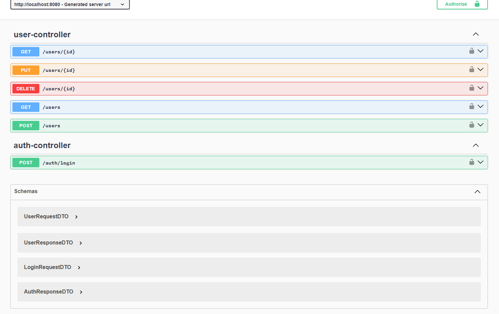
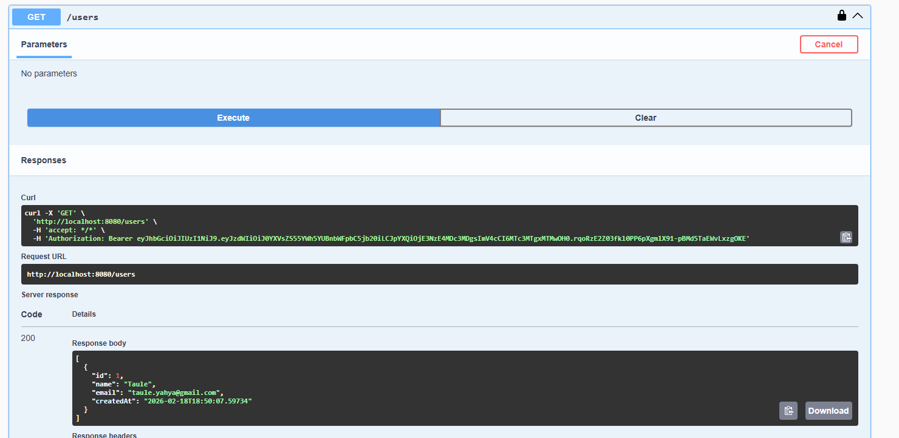

# Secure User API - Spring Boot + JWT

API REST construída com Spring Boot para gestão de usuários com autenticação JWT e controle de acesso stateless.

## Funcionalidades

- Cadastro de usuário
- Autenticação via JWT
- Autorização baseada em roles (USER / ADMIN)
- Tratamento global de exceções
- Validação com Bean Validation
- Documentação automática com Swagger

## Stack e dependências principais

- Java 17
- Spring Boot 3.2.5
- Spring Web
- Spring Data JPA
- Spring Security
- Bean Validation
- PostgreSQL
- JWT (jjwt)
- Swagger/OpenAPI (springdoc)

## Arquitetura (alto nível)

- `controller`: expõe endpoints HTTP (`/auth` e `/users`).
- `service`: concentra regras de negócio de usuário e integração com `UserDetailsService`.
- `repository`: acesso a dados via `JpaRepository`.
- `entity`: modelo persistente (`User`) implementando `UserDetails`.
- `security`: geração/validação de JWT e filtro de autenticação.
- `config`: configuração de segurança, encoder de senha e OpenAPI.
- `exception`: tratamento global de erros para respostas padronizadas.

## Fluxo de autenticação

1. Cliente chama `POST /auth/login` com email/senha.
2. API valida credenciais e retorna token JWT.
3. Cliente envia `Authorization: Bearer <token>` nas rotas protegidas.
4. `JwtAuthenticationFilter` valida o token e autentica no contexto de segurança.

## Endpoints principais

### Autenticação

- `POST /auth/login`

### Usuários

- `POST /users` (público, cria usuário)
- `GET /users` (protegido)
- `GET /users/{id}` (protegido)
- `PUT /users/{id}` (protegido)
- `DELETE /users/{id}` (protegido)

## Segurança

- Sessão stateless (`SessionCreationPolicy.STATELESS`).
- CSRF desabilitado para API stateless.
- Rotas públicas:
  - `/auth/**`
  - `/v3/api-docs/**`
  - `/swagger-ui/**`
  - `POST /users`
- Demais rotas exigem autenticação por JWT.

### Exemplo de resposta autenticada

```json
{
  "id": 1,
  "name": "Thales",
  "email": "thales@email.com",
  "createdAt": "2026-02-20T15:30:00"
}
```

### Exemplo de erro padronizado

```json
{
  "timestamp": "2026-02-20T15:40:00",
  "status": 400,
  "error": "Business Error",
  "message": "Email já cadastrado"
}
```

## Como executar

1. Configure credenciais de banco copiando `src/main/resources/application-example.properties` para `application.properties` e ajuste os valores.
2. Execute:

```bash
./mvnw spring-boot:run
```

## Preview da API

### Swagger UI



---

### Exemplo autenticação GET

GET /users com token JWT válido retornando 200 OK:



## Documentação da API

Com a aplicação em execução:

- Swagger UI: `http://localhost:8080/swagger-ui/index.html`
- OpenAPI JSON: `http://localhost:8080/v3/api-docs`
